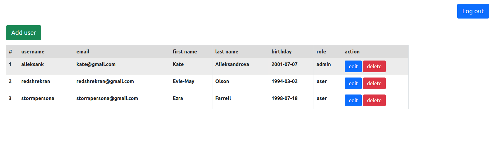
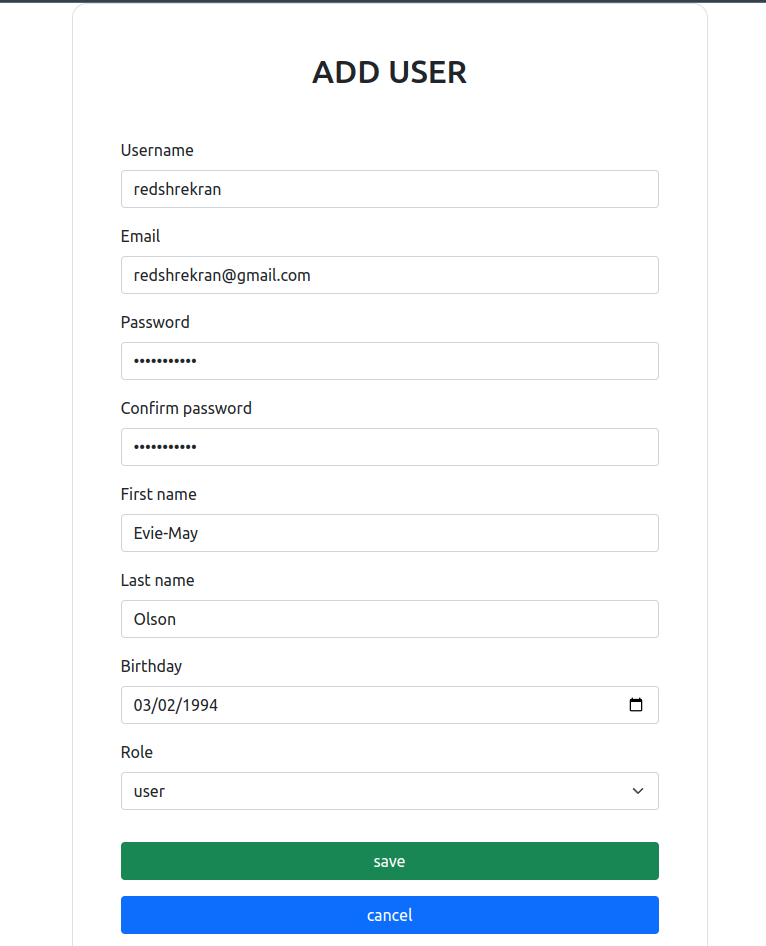
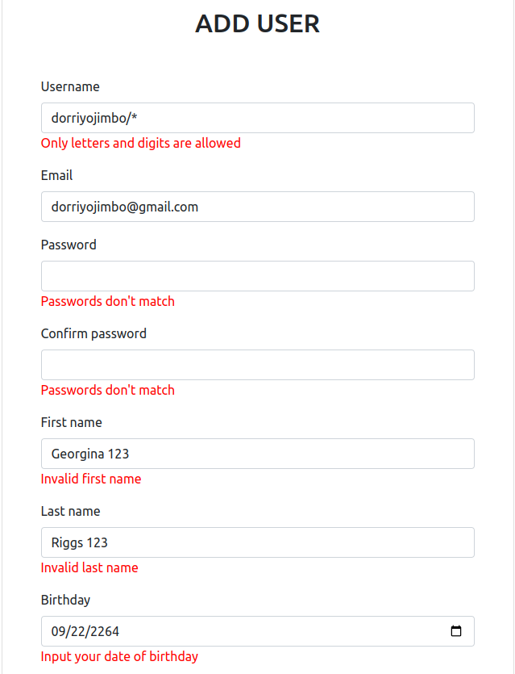
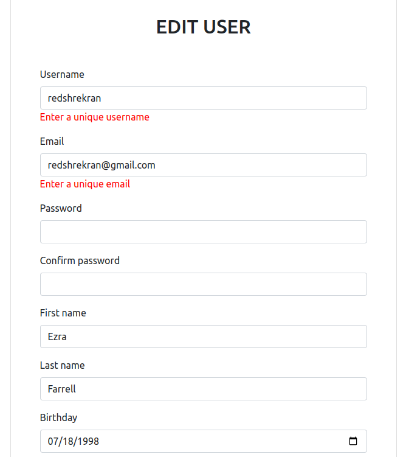

# springmvc_user_role
This application implements role-based authorization using Spring Security.
There are two roles: ADMIN and USER. After a successful login, the user will be redirected to the role home page.

ADMINs can ADD new users, EDIT and DELETE existing ones. The data passed into EDIT/ADD form is validated on back-end.

# How to test application
1) Clone repository `https://github.com/jakiepiekne/springmvc_user_role.git`

2) From the project directory, start up application by running `docker-compose up`

3) Go to `localhost:8080`

## Technology stack
#### front-end:
<ul>                                                                 
  <li>Bootstrap 5;</li>                                                     
  <li>Thymeleaf;</li>                                                       
</ul>                                                                

#### back-end:
<ul>
       <li>Spring MVC;</li>
       <li>Spring Security;</li>
</ul>

#### data layer:
<ul>
       <li>Hibernate;</li>
</ul>

#### database:
<ul>
       <li>MySQL;</li>
</ul>     

#### building tool:
<ul>
      <li>Maven.</li>
</ul>

# Overview
User with ADMIN permissions after authorization will be redirected to ADMIN home page, which 
consist the list of users retrieved from the database:

Admin can add new users to the database:

If passed data was invalid, validation errors will be displayed:

If not unique username/email is passed to edit user form, validation errors also will be displayed:

